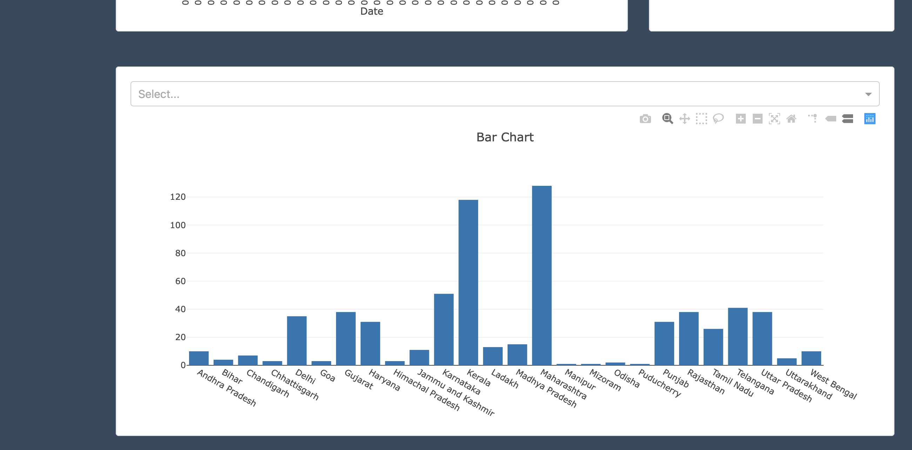

# COVID Dashboard 

A simple Dash + Flask dashboard that visualizes COVID-19 data for India using the CSV datasets in this repository. This README documents how to set up the development environment, common troubleshooting steps (derived from the environment issues encountered), and how to run and deploy the app.

---



## Contents

* `app.py` — main Dash application 
* `IndividualDetails.csv` — patient-level records used for counts and the state-wise bar chart
* `covid_19_india.csv` — time series used for the line plot (daily cumulative cases)
* `AgeGroupDetails.csv` — age-group distribution used for the pie chart
* `assets/` — static assets (images/CSS) if present
* `Procfile` — (optional) for Heroku/Render deployment
* `requirements.txt` — Python package pins (see notes below)

---

## Quick start (recommended)

These steps create an isolated Python environment, install working dependencies, and run the app locally.

> Tested on macOS (Apple Silicon & Intel) using `pyenv` + `venv` with Python 3.10.12.

1. Clone the repo and change into the project folder:

```bash
git clone https://github.com/iroshankumar/CoronaVirus-Dashboard.git
cd 
```

2. (Optional but recommended) install `pyenv` and a compatible Python version (3.10.12 used here):

```bash
# macOS Homebrew example
brew install pyenv
pyenv install 3.10.12
pyenv local 3.10.12
```

3. Create and activate a virtual environment using the pyenv-controlled Python:

```bash
python -m venv venv
source venv/bin/activate
```

4. Upgrade build tools and install helpful build helpers:

```bash
pip install --upgrade pip setuptools wheel
pip install cython
```

5. Install the dependencies. If you want reproducibility, use the provided `requirements.txt` after reading the Troubleshooting section. Otherwise, install and pin minimal working packages:

```bash
# Minimal working set (matches the environment used during testing):
pip install "numpy<2.0,>=1.23" pandas==1.5.3 dash==1.9.1 Flask==1.1.1 Jinja2==2.11.3 MarkupSafe==1.1.1 Werkzeug==1.0.1 itsdangerous==1.1.0 click==7.1.1 gunicorn
```

> Or, if you want to use the repository pins (may require fixes), run:

```bash
pip install -r requirements.txt
```

6. Run the app:

```bash
python app.py
```

Open `http://127.0.0.1:8050/` in your browser.

---

## Troubleshooting (frequently encountered issues & fixes)

This project historically used older pinned packages. Running `pip install -r requirements.txt` on modern systems may lead to build or import errors. Below are the fixes that were used successfully when setting up this project:

### 1. `numpy` build errors (metadata generation failed)

**Symptom:** `error: metadata-generation-failed` when installing `numpy==1.18.2`.

**Cause:** Old numpy pinned in `requirements.txt` has no prebuilt wheel for your Python/OS and pip tries to compile from source.

**Fix:** Use a Python version that matches old pins (via `pyenv`) or upgrade the numpy pin to a wheel-supported version. Example:

```bash
# Option (preferred): use Python 3.10 and install a compatible NumPy
pyenv install 3.10.12
pyenv local 3.10.12
python -m venv venv
source venv/bin/activate
pip install "numpy<2.0,>=1.23"
```

### 2. Pandas + NumPy ABI error (`numpy.dtype size changed`)

**Symptom:** `ValueError: numpy.dtype size changed, may indicate binary incompatibility. Expected X from C header, got Y from PyObject` when importing pandas.

**Cause:** Binary incompatibility between NumPy 2.x and pandas 1.5.x.

**Fix:** Either downgrade NumPy to `<2.0` (recommended for pandas 1.5.x) or upgrade pandas to a release that supports NumPy 2.x. For the tested setup we used:

```bash
pip uninstall -y numpy pandas
pip install "numpy<2.0,>=1.23" pandas==1.5.3
```

### 3. Flask/Jinja2/MarkupSafe/Werkzeug import errors (`jinja2.escape` / `soft_unicode`)

**Symptom:** `ImportError: cannot import name 'escape' from 'jinja2'` or `ImportError: cannot import name 'soft_unicode' from 'markupsafe'`.

**Cause:** Newer Jinja2/MarkupSafe/Werkzeug releases removed or renamed symbols that older Flask versions expect.

**Fix:** Install a compatible stack for Flask 1.1.1 (the stack used in this repo):

```bash
pip install --force-reinstall "Flask==1.1.1" "Jinja2==2.11.3" "MarkupSafe==1.1.1" "Werkzeug==1.0.1" "itsdangerous==1.1.0" "click==7.1.1"
```

**Tip:** Install the whole set in one command so pip can choose compatible builds together. If things get messy, create a fresh venv and re-install the pinned stack.

---

## Files & code overview

`app.py` contains a small Dash app that:

* Reads `IndividualDetails.csv` and computes totals (Total Cases, Active, Recovered, Deaths)
* Uses `covid_19_india.csv` to create a cumulative daily line chart
* Uses `AgeGroupDetails.csv` to create a pie chart of age distribution
* Renders a dropdown to filter a state-wise bar chart by patient status

If you modify `app.py`, be careful with the imports at the top — older Dash versions use `dash_html_components` and `dash_core_components` as separate packages. On more recent Dash versions you may import them directly from `dash`.

---

## Development tips

* Reproducibility: once the app runs, save the exact working environment:

```bash
pip freeze > requirements.txt
```

* Use `pyenv` to match the Python version used for the project (3.10.12 in this README). That avoids many wheel and ABI problems.

* If you plan to modernize the app (upgrade Dash/Flask/pandas), update `app.py` imports and test charts and layout — Dash made some import/namespace changes in recent major versions.

---

## Deployment suggestions

* **Render** or **Railway**: both are simple for small Python web apps. They detect `requirements.txt` and use `gunicorn` if a `Procfile` is present.

* **Heroku**: works with the included `Procfile`. Remember to set `web: gunicorn -b 0.0.0.0:$PORT app:server` in `Procfile` if your app exposes `server`.

* **Docker**: create a Dockerfile that installs the specific pins that worked locally. This is the most reproducible deployment approach.

Example minimal `Procfile`:

```
web: gunicorn -b 0.0.0.0:$PORT app:server
```

---

## Useful commands (copy/paste)

```bash
# create venv, activate
python -m venv venv
source venv/bin/activate

# upgrade tooling
pip install --upgrade pip setuptools wheel
pip install cython

# install tested stack
pip install "numpy<2.0,>=1.23" pandas==1.5.3 dash==1.9.1 Flask==1.1.1 Jinja2==2.11.3 MarkupSafe==1.1.1 Werkzeug==1.0.1 itsdangerous==1.1.0 click==7.1.1 gunicorn

# run app
python app.py

# freeze working environment
pip freeze > requirements.txt
```

---

## License

This repository has no license file by default. Add a `LICENSE` file if you wish to make the project open-source with a chosen license.
